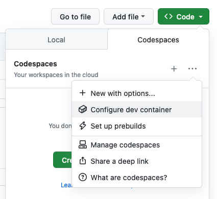
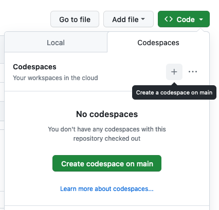
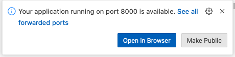

= Developing with Elm on GitHub Codespaces
:doctype: article
:encoding: utf-8
:lang: en
:toc: left
:numbered:

== Introduction
If you want to develop with Elm on Codespaces, this document provides the getting-started instructions.

== Create a Repository

. Log into Github and press the + in the top-right corner. Select *new repository*.
. Provide a name, add a README file and select the .gitignore for Elm
. Press [Create Repository]

We now have a repository with this .gitignore file:

----
# elm-package generated files
elm-stuff
# elm-repl generated files
repl-temp-*
----

== Configure the Devcontainer
We will configure the container to include:

- Elm
- Elm vscode extension
- Supporting programs elm-test, elm-format and elm-review

The steps to follow:

. Press the green [Code] button.
. Select the Codespaces tab
. Press the [ ... ] on the right (Codespace repository configuration)
+

. Select *Configure dev container*. This will create a default `.devcontainer.json`.
. Copy and paste the snippet below. Your file should then look like this:
+
./.devcontainer/devcontainer.json
----
{
  "image": "mcr.microsoft.com/devcontainers/universal:2",
  "features": {
    "ghcr.io/devcontainers-contrib/features/elm-asdf:2": {}
  },
  "postCreateCommand": "npm install -g elm-test elm-format elm-review",
  "customizations": {
    "vscode": {
      "extensions": [
        "elmTooling.elm-ls-vscode"
      ]
    }
  }
}
----

. Press the [Commit Changes...] button and commit directly to the main branch.

== Create a Codespace
. On the code tab, press the green [Code] button
+

. Press [Create codespace on main]. A new browser tab is opened and displays __Setting up your codespace__. After a while you see the explorer.

== Create demo program
. At the terminal, enter `elm init`.
. In the left menu, click on the Explorer button.
. Navigate to the `src` folder and right-click `New File ...`. Enter filename `Main.elm`. This opens the editor.
. Paste the sample code from https://elm-lang.org/examples/buttons and save the file.

== Run the demo program
. In the terminal, enter `elm reactor`
. In the bottom-right of your screen, this box appears:
+

+
Press the [Open in Browser] button. The Elm reactor screen appears
. Click on the `src` folder and then on `Main.elm`

Your program is running!

== Stop the codespace
. Press F1 (or hamburger menu > View > Command palette)
. Enter `co st` to select command `Codespaces: Stop current codespace`

== Appendix A: Defining the container step-by-step
Earlier in this document we specified the `.devcontainer.json` file in one step. For those that would to build it step-by-step, here are the instructions.

=== Define the base container
. Press the green [Code] button.
. Select the Codespaces tab
. Press the [ ... ] on the right (Codespace repository configuration)
+

. Select *Configure dev container*. This will create a default `.devcontainer.json`.
. In the Marketplace list on the right, enter `elm` in the search-box and choose `Elm (via asdf)`.
. Copy and paste the snippet as instructed. Your file should then look like this:
+
./.devcontainer/devcontainer.json
----
{
  "image": "mcr.microsoft.com/devcontainers/universal:2",
  "features": {
    "ghcr.io/devcontainers-contrib/features/elm-asdf:2": {}
  }
}
----
. We'll want a few more programs installed in our codespace. Add a `postCreateCommand` (remember to add the comma on the preceding line!). The file now looks like this:
+
./.devcontainer/devcontainer.json
----
{
  "image": "mcr.microsoft.com/devcontainers/universal:2",
  "features": {
    "ghcr.io/devcontainers-contrib/features/elm-asdf:2": {}
  },
  "postCreateCommand": "npm install -g elm-test elm-format elm-review"
}
----
. Press the [Commit Changes...] button and commit directly to the main branch.

=== Create a Codespace
. On the code tab, press the green [Code] button
+

. Press [Create codespace on main]. A new browser tab is opened and displays Setting up your codespace. After a while you see the explorer.

=== Install VS-Code Elm Extension
. Press the Extensions button on the left (button with 4 squares)
. Enter `elm` in the searchbox. Select `Elm` from *Elm tooling* and then select [Install in Codespaces].
. Select the extension settings and choose `add to devcontainer.json`
